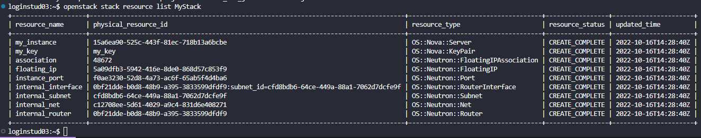

Joakim Edvardsen

# Assignment 4

## Notes from task 3

To create the same infrastructure as in assignment 2 you need:

- A network
  - With a subnet for floating IP
- A router with an interface to connect your network to ntnu-internal
- A key pair used to connect
- A VM running on a compute resource (m1.small, m1.medium, etc..)

_Also need to either create a new security group or add a new rule to an already existing security group to allow ssh (listen on port 22)_

## Definition code

```
heat_template_version: 2021-04-16

description: Template to deploy a VM with floating IP

parameters:
  key_name:
    type: string
    description: Name of key pair
    label: Key name
    default: my_key

resources:
  internal_net:
    type: OS::Neutron::Net

  internal_subnet:
    type: OS::Neutron::Subnet
    properties:
      network_id: { get_resource: internal_net }
      cidr: '10.8.1.0/24'
      dns_nameservers: ['8.8.8.8', '8.8.4.4']
      ip_version: 4

  internal_router:
    type: OS::Neutron::Router
    properties:
      external_gateway_info: { network: ntnu-internal }

  internal_interface:
    type: OS::Neutron::RouterInterface
    properties:
      router_id: { get_resource: internal_router }
      subnet: { get_resource: internal_subnet }

  instance_port:
    type: OS::Neutron::Port
    properties:
      network: { get_resource: internal_net }
      fixed_ips:
        - subnet_id: { get_resource: internal_subnet }

  floating_ip:
    type: OS::Neutron::FloatingIP
    properties:
      floating_network_id: ntnu-internal
      port_id: { get_resource: instance_port }

  association:
    type: OS::Neutron::FloatingIPAssociation
    properties:
      floatingip_id: { get_resource: floating_ip }
      port_id: { get_resource: instance_port }

  my_key:
    type: OS::Nova::KeyPair
    properties:
      save_private_key: true
      name: { get_param: key_name }

  my_instance:
    type: OS::Nova::Server
    properties:
      key_name: { get_resource: my_key }
      image: fe8be799-21f4-489a-9e3f-9b8a2e15c015 # Ubuntu Server 20.04 amd64
      flavor: m1.small
      networks:
        - port: { get_resource: instance_port }

outputs:
  instance_ip:
    description: The IP address of the deployed MV
    value: { get_attr: [my_instance, first_address] }

  instance_floating_ip:
    description: Floating IP of the deployed VM
    value: { get_attr: [floating_ip, floating_ip_address] }

  private_key:
    description: Private key
    value: { get_attr: [my_key, private_key] }
```

## Stack resource list



## Commands for stopping & deleting stack

**Stopping:**

```
openstack stack suspend stack-name
```

_To resume after stopping:_

```
openstack stack resume stack-name
```

**Delete:**

```
openstack stack delete stack-name
```
