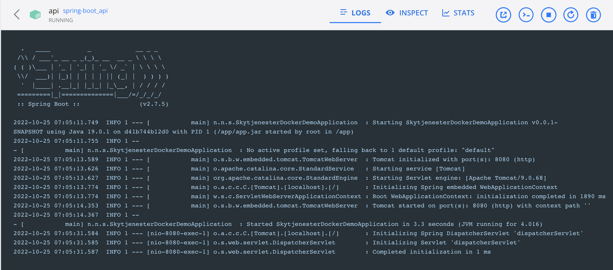
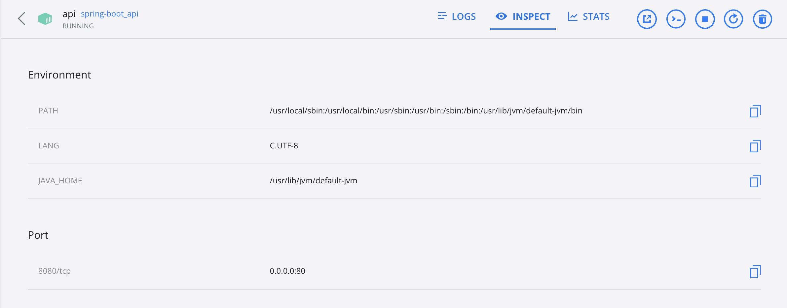

Joakim Edvardsen

# Asiignment 5 - Docker & Kubernetes

## Docker concepts

### Containers

### Images

### Dockerfile

## Task 2 - Create a container

Created a basic spring-boot web application with a "Hello world" endpoint at `/hello`

Created a Dockerfile that uses `amazoncorretto`, takes the .jar file created whe building the spring-boot and copies it into the container before running `java -jar app.jar` to run it.

Heres the Dockerfile:

```yml
FROM amazoncorretto:19.0.1-alpine

WORKDIR /app

COPY target/*.jar app.jar

ENTRYPOINT ["java","-jar","app.jar"]
```

To run it, first create the image: (creates image base on current directory)

```
docker build -t jkm00/spring-boot .
```

Second, create a container based on the image:

```
docker run -p 8080:8080 jkm00/spring.boot
```

_jkm00 is my username on docker hub, replace this with your username (or simply remove it)_

Also created a simple dokcer-compose that uses the Dockerfile above when spinning ut a container. Heres the file:

```yml
version: "3"
services:
  api:
    container_name: api
    build:
      context: ./
      dockerfile: Dockerfile
    ports:
      - 80:8080
```

To run this, use:

```
docker-compose up -d
```

**Image of running container (with docker-compose):**






## Task 3 - Create a Docker Compose with a minimume of two services

Used the same basic spring-boot application from above, but this time I added a PostgreSQL database.
