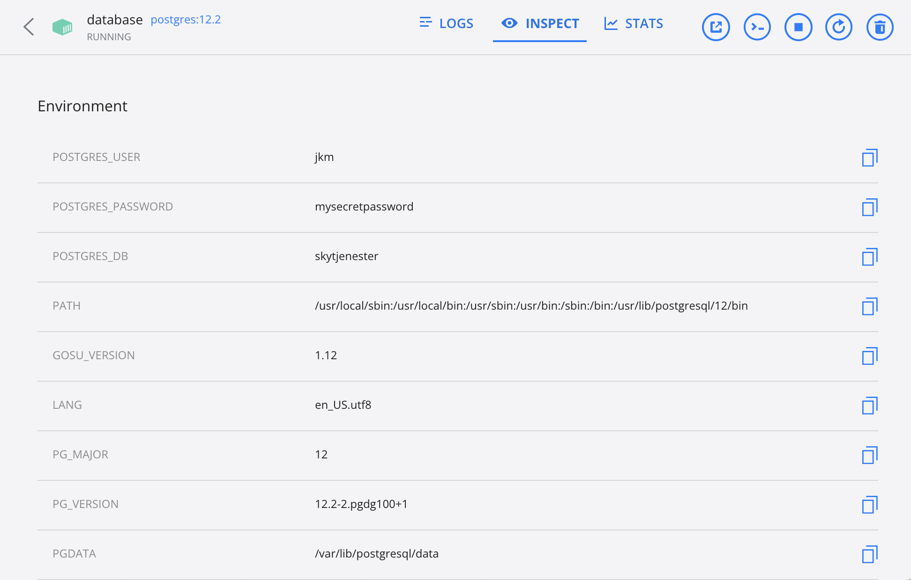
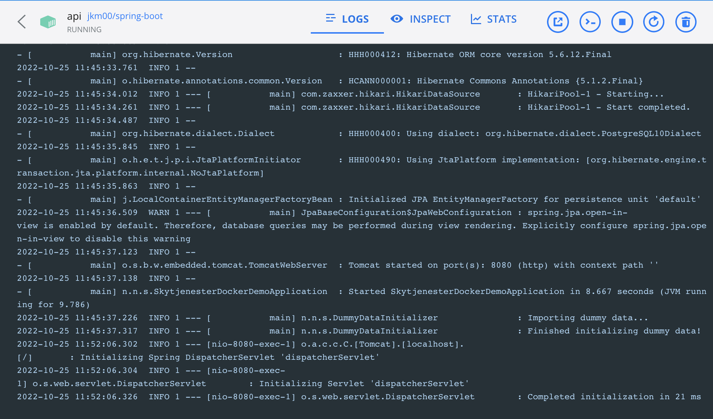
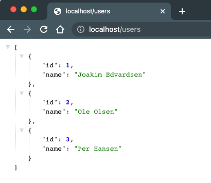

Joakim Edvardsen

# Assignment 5 - Docker & Kubernetes

## Docker concepts

### Images

An images is a file that or template with instruction for creating a docker container.

### Containers

A container is a runnable instance of an image. The containers can be created, started, stopped, moved and deleted. The idea is that you define a container via an image and then you can easely spin up containers to run your application.

## Task 2 - Create a container

Created a basic spring-boot web application with a "Hello world" endpoint at `/hello`

Created a Dockerfile that uses `amazoncorretto`, takes the .jar file created whe building the spring-boot and copies it into the container before running `java -jar app.jar` to run it.

Heres the Dockerfile:

```yml
FROM amazoncorretto:19.0.1-alpine

WORKDIR /app

COPY target/*.jar app.jar

ENTRYPOINT ["java","-jar","app.jar"]
```

To run it, first create the image: (creates image base on current directory)

```
docker build -t jkm00/spring-boot .
```

Second, create a container based on the image:

```
docker run -p 8080:8080 jkm00/spring.boot
```

_jkm00 is my username on docker hub, replace this with your username (or simply remove it)_

Also created a simple dokcer-compose that uses the Dockerfile above when spinning ut a container. Heres the file:

```yml
version: "3"
services:
  api:
    container_name: api
    build:
      context: ./
      dockerfile: Dockerfile
    ports:
      - 80:8080
```

To run this, use:

```
docker-compose up -d
```

**Image of running container (with docker-compose):**


**Image of accessing `/hello` endpoint:**


## Task 3 - Create a Docker Compose with a minimume of two services

For this I used the same basic spring-boot application from above, but this time I connected it to a PostgreSQL database.

For this I had to create a docker-compose file that firstly boots ut the PostgreSQL container, and when this container is up and running only then will the container with the spring-boot application spin up.

Heres the docker-compose file:

```yaml
version: "3.5"
services:
  api:
    container_name: api
    image: jkm00/spring-boot
    ports:
      - 80:8080
    environment:
      - "SPRING_PROFILE_ACTIVE=prod"
      - POSTGRES_PORT=${POSTGRES_PORT}
      - POSTGRES_DB=${POSTGRES_DB}
      - POSTGRES_USER=${POSTGRES_USER}
      - POSTGRES_PASSWORD=${POSTGRES_PASSWORD}
    # Make sure database is up and running before starting the api
    depends_on:
      db:
        condition: service_healthy

  db:
    container_name: database
    image: postgres:12.2
    restart: always
    environment:
      - POSTGRES_USER=${POSTGRES_USER}
      - POSTGRES_PASSWORD=${POSTGRES_PASSWORD}
      - POSTGRES_DB=${POSTGRES_DB}
    ports:
      - ${POSTGRES_PORT}:5432
    healthcheck:
      test: ["CMD-SHELL", "pg_isready"]
      interval: 10s
      timeout: 5s
      retries: 5
```

_Note the `depends_on` attribute in the `api` definition_

I used the same docker images for the spring-boot as I used in the task 2.

Because this file is usually a file stored in a git repository, you dont want to expose all the database credentials. Thats why I've used environment variables. These variables are stored in a local `.env` file that is not pushed to the repository. Docker will automatically read any file with the `.env` extension and populate the variables in the docker-compose file.

Heres an example of the `.env` file:

```
POSTGRES_NAME=somename
POSTGRES_USER=someusername
POSTGRES_PASSWORD=asecretpassword
POSTGRES_PORT=5432
POSTGRES_DB=somedbname
```

**Images of running containers:**






**Result of accessing `/users` endpoint:**



## Docker vs Kubernetes

- Docker is a way of containerizing your application, meaning creating an isolated environment for the application.
- Kubernetes is a way of structuring the containers. Grouping the containers that make up an application in a cluster.
- Docker is great for automatic building and deployment (Before for and during deployment)
- Kubernetes is great for scheduling and managing the containers after deployment.
- Kubernetes has support for automatic scaling and monitoring

## Sources

- [Docker vs Kubernetes](https://www.youtube.com/watch?v=9_s3h_GVzZc&ab_channel=TechWorldwithNana)
- [Docker documentation](https://docs.docker.com/get-started/overview/)
