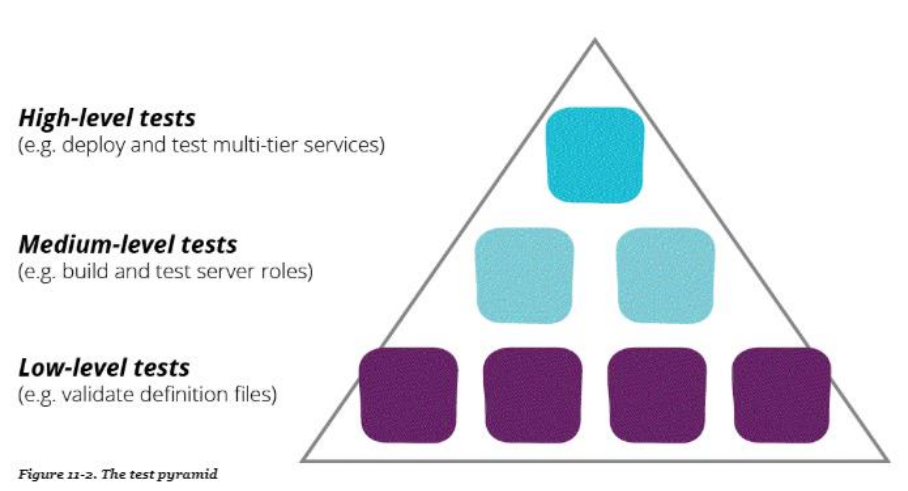

# Quality, CI & CD

## Quality

Poor-quality systems are difficult to change, whereas high-quality systems are easier and safer to change

### How to achieve good quality (Agile manifesto)

- deliver useful code early
- deliver in small, useful increments
- build only what is necessary at the moment
- build each increment as simply as possible
- get feedback on every change as early as possible
- requirements will change as developers and users learn
- everything will have to change as the system evolves

## CI in practice

Write test -> implement code -> if test still fails, fix it immediately

# Testing

## Different levels of testing

- User tests
- Unit test
- System / infrastructure tests
- Performance tests

## Goals of testing

Discover bugs or errors before it's pushed to production

## Test Pyramid

|  |
| :-----------------------------------: |
|           **Test Pyramid**            |
